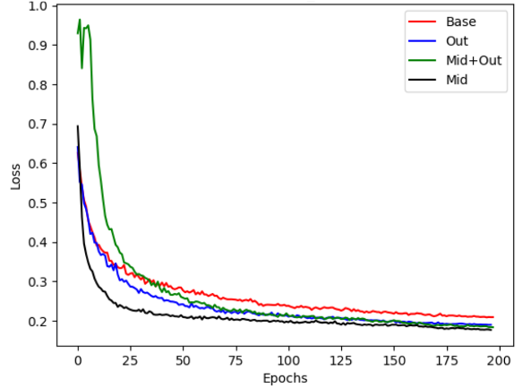
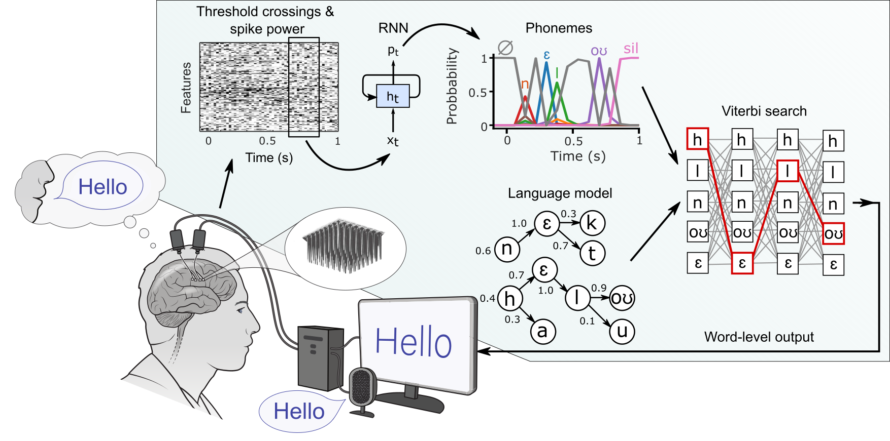

## Result

### Task 1. Brain to Phonemes

|                      |      GRU layer     |   Add position  | # of Layers |  d_model | n_heads |  ff_dim  |    CER    |
|:--------------------:|:------------------:|:---------------:|:-----------:|:--------:|:-------:|:--------:|:---------:|
|       Baseline       |          5         |        -        |      -      |     -    |    -    |     -    |   0.188   |
|       Baseline       | GRU + Bi-direction |        -        |      -      |     -    |    -    |     -    |   0.185   |
|       Baseline       | LSTM + Bidirection |        -        |      -      |     -    |    -    |     -    |   0.185   |
|   Base + Attention   |          5         |      Output     |      1      |   1024   |    2    |   4096   |   0.188   |
|   Base + Attention   |          5         |      Middle     |      1      |   1024   |    2    |   2048   |   0.186   |
| **Base + Attention** |        **5**       |    **Middle**   |    **1**    | **1024** |  **2**  | **4096** | **0.176** |
|   Base + Attention   |          5         | Middle + Output |    1 + 1    |   1024   |    2    |   1024   |   0.187   |
|   Base + Attention   |          5         | Middle + Output |    1 + 1    |   1024   |    2    |   4096   |   0.183   |
|   Dense + Attention  |          -         |        -        |      4      |    512   |    2    |    512   |   0.282   |
|   Dense + Attention  |          -         |        -        |      6      |    512   |    8    |   1024   |   0.295   |


#### Validation(CER) Curves of ff_dim 4096




### Task 2. Phonemes to Sentence

|                Method               |    WER    |
|:-----------------------------------:|:---------:|
|           GRU-Base + 3gram          |   0.156   |
|       GRU-Bi-direction + 3gram      |   0.151   |
|           GRU-Base + GPT2           |   0.153   |
|   GRU-Bi-direction + GPT2 + K=100   |   0.146   |
| **GRU-Bi-direction + GPT2 + K=200** | **0.133** |
|     Not Pre-Trained Transformer (4, 128, 512, 8)    |   0.562   |
|    Not Pre-Trained Transformer (6, 512, 2048, 8)    |   0.584   |


### (Opt Task 3) Brain to Sentence (Direct Decoding)

|             Method            |  WER  |
|:-----------------------------:|:-----:|
|  Not Pre-Trained Transformer (4, 128, 512, 8) | 0.998 |
| Not Pre-Trained Transformer (6, 512, 2048, 8) | 0.965 |


## My Additional Contributions Task List

```_brain_to_sen_model.py``` / ```_brain_to_sen.py```

```_encoder_only.py``` / ```_encoder_transformerNeuralDecoder```

```_pho_to_sen.py``` / ```_pho_decode_model.py```

```deepspeech_attention.py``` / ```deepspeech.py```

```models.py``` / ```neuralSequenceDecoder.py``` *(Parital)


## How to Run

1. Download the data at https://datadryad.org/stash/dataset/doi:10.5061/dryad.x69p8czpq ```competitiondata, languageModel``` and move proper path


2. Make TF records ```AnalysisExamples/makeTFRecordsFromSession_TransformerTrain.py``` and ```AnalysisExamples/makeTFRecordsFromSession.py```


3. Edit the ```NeuralDecocer/neuralDecoder/configs``` and ```NeuralDecoder/neuralDecoder/datasets``` Path and Hyper parameters


4. Set the model type in main.py

5. ```
   python3 -m neuralDecoder.main \
    dataset=speech_release_baseline \
    model=gru_stack_inputNet \
    learnRateDecaySteps=10000 \
    nBatchesToTrain=10000  \
    learnRateStart=0.02 \
    outputDir="Your Path"
   ```

# Original Repo Link

https://github.com/fwillett/speechBCI

---------------------------------------------------------------------------

## A high-performance speech neuroprosthesis
[](https://www.nature.com/articles/s41586-023-06377-x)

## Overview

This repo is associated with this [paper](https://www.nature.com/articles/s41586-023-06377-x), [dataset](https://doi.org/10.5061/dryad.x69p8czpq) and machine learning [competition](https://eval.ai/web/challenges/challenge-page/2099/overview). The code contains the RNN decoder (NeuralDecoder) and language model decoder (LanguageModelDecoder) used in the paper, and can be used to reproduce the core offline decoding results. 

The jupyter notebooks in AnalysisExamples show how to [prepare the data for decoder training](AnalysisExamples/rnn_step1_makeTFRecords.ipynb), [train the RNN decoder](AnalysisExamples/rnn_step2_trainBaselineRNN.ipynb), and [evaluate it using the language model](AnalysisExamples/rnn_step3_baselineRNNInference.ipynb). Intermediate results from these steps (.tfrecord files for training, RNN weights from my original run of this code) as well as the 3-gram and 5-gram language models we used are available [here](https://doi.org/10.5061/dryad.x69p8czpq) (in the languageModel.tar.gz, languageModel_5gram.tar.gz, and derived.tar.gz files). 

Example neural tuning analyses (e.g., classification, PSTHs) are also included in the AnalysisExamples folder ([classificationWindowSlide.ipynb](AnalysisExamples/classificationWindowSlide.ipynb), [examplePSTH.ipynb](AnalysisExamples/examplePSTH.ipynb),[naiveBayesClassification.ipynb](AnalysisExamples/naiveBayesClassification.ipynb), [tuningHeatmaps.ipynb](AnalysisExamples/tuningHeatmaps.ipynb), [exampleSaliencyMaps.ipynb](AnalysisExamples/exampleSaliencyMaps.ipynb)).

## Train/Test/CompetitionHoldOut Partitions

We have partitioned the data into a "train", "test" and "competitionHoldOut" partition (the partitioned data can be downloaded [here](https://doi.org/10.5061/dryad.x69p8czpq) as competitionData.tar.gz and has been formatted for machine learning). "test" contains the last block of each day (40 sentences), "competitionHoldOut" contains the first two (80 sentences), and "train" contains the rest. 

The transcriptions for the "competitionHoldOut" partition are redacted. See [baselineCompetitionSubmission.txt](AnalysisExamples/baselineCompetitionSubmission.txt) for an example submission file for the [competition](https://eval.ai/web/challenges/challenge-page/2099/overview) (which is generated by [this notebook](AnalysisExamples/rnn_step3_baselineRNNInference.ipynb)).

## Results

When trained on the "train" partition and evaluated on the "test" partition, our original run of the code achieved an 18.8% word error rate (RNN + 3-gram baseline) and a 13.7% word error rate (RNN + 5-gram + OPT baseline). For results on the "competitionHoldOut" partition, see the baseline word error rates [here](https://eval.ai/web/challenges/challenge-page/2099/leaderboard/4944). 

## Installation

NeuralDecoder should be installed as a python package (pip install -e .) using Python 3.9. LanguageModelDecoder needs to be compiled first and then installed as a python package (see LanguageModelDecoder/README.md). 


